```{=latex}
\providecommand{\pandocbounded}[1]{#1}
```

```{r setup, include=FALSE}
library(tidyverse)
library(knitr)
library(kableExtra)

knitr::opts_chunk$set(fig.align = "center", out.width = "100%")

# Paleta de la memoria visual del informe: azul = clase "no", naranja = "yes".
# El color sigue siempre a la entidad, nunca al orden de la barra.
C_AZUL    <- "#2a78d6"
C_NARANJA <- "#eb6834"
C_TINTA   <- "#0b0b0b"

# ------------------------------------------------------------------------------
# Las tablas y figuras las produce el pipeline de Python (src/eda_bank.py), que
# es la fuente unica de verdad de las cifras. Aqui solo se leen, de modo que el
# informe y el script no puedan desincronizarse.
# ------------------------------------------------------------------------------
leer_tabla <- function(x) readr::read_csv(file.path("tablas", x), show_col_types = FALSE)

cifras <- leer_tabla("tbl_cifras_clave.csv") |>
  tibble::deframe()

# Valor puntual por nombre, formateado para intercalar en el texto.
v <- function(k, dec = 2) format(round(cifras[[k]], dec), big.mark = ",", trim = TRUE)

# `ajustar = TRUE` pide scale_down. Aviso por si se reutiliza esta funcion:
# Quarto emite estas tablas como `longtable`, y kableExtra DESCARTA scale_down
# en longtable sin avisar (no se puede meter un longtable en un \resizebox).
# Se comprobo inspeccionando el .tex generado: no aparece ningun \resizebox.
# Para que una tabla ancha quepa hay que reducir su contenido -como se hace en
# la matriz de covarianzas, abreviando encabezados- o pasarla a apaisado.
tabla_bonita <- function(d, cap, fs = 9, ajustar = FALSE) {
  opciones <- c("HOLD_position", "striped")
  if (ajustar) opciones <- c(opciones, "scale_down")
  d |>
    kable(booktabs = TRUE, linesep = "", caption = cap,
          format.args = list(big.mark = ",")) |>
    kable_styling(latex_options = opciones, font_size = fs) |>
    row_spec(0, bold = TRUE, align = "c")
}
```

\newpage

# CONTEXTO DEL DATASET

## Descripción del problema

Una institución bancaria portuguesa ejecutó, entre **mayo de 2008 y noviembre de
2010**, una serie de campañas de marketing directo por vía telefónica. El
producto ofrecido fue un **depósito a plazo fijo**: un instrumento de ahorro en
el que el cliente inmoviliza un capital durante un período pactado a cambio de
una tasa de interés.

El problema de negocio es de eficiencia. Llamar es caro: consume tiempo de
operador, minutos de telefonía y, sobre todo, paciencia del cliente. Con una
tasa de aceptación cercana al **`r v("tasa_global_pct")`%**, aproximadamente
nueve de cada diez llamadas terminan en rechazo. Cada punto porcentual de mejora
en la selección de a quién llamar se traduce directamente en costo evitado.

## Fuente

Los datos provienen del repositorio *UCI Machine Learning Repository* y fueron
recopilados y documentados por @moro2014 y @moro2011 [@uci_bank]. Se trabaja con el archivo
`bank-additional-full.csv`, la versión ampliada de 2014, que incorpora cinco
indicadores macroeconómicos ausentes en la versión original de 2012.

Esa elección es deliberada: el período cubierto coincide con la crisis
financiera global, y la disposición de un cliente a inmovilizar capital depende
del contexto de tasas tanto como de su perfil personal. Sin las variables
macroeconómicas, ese eje del fenómeno queda invisible.

## Objetivo del análisis

El objetivo de esta primera entrega es **entender y dejar utilizable** el
conjunto de datos, no todavía predecir. En concreto:

1. Diagnosticar la calidad real de los datos, distinguiendo lo que el archivo
   *declara* de lo que efectivamente contiene.
2. Documentar y justificar cada transformación aplicada.
3. Caracterizar el comportamiento univariado y multivariado de las variables,
   identificando cuáles aportan señal frente a la suscripción y cuáles
   introducen problemas para el modelado posterior.

La variable objetivo es `suscribio` (`y` en el archivo original): indica si el
cliente contrató o no el depósito a plazo.

\newpage

# CARGA Y EXPLORACIÓN INICIAL

## Dimensiones y estructura

```{r}
#| echo: true
#| label: tbl-estructura
#| tbl-cap: "Estructura del dataset original: tipo de dato, registros no nulos y cardinalidad por variable."
leer_tabla("tbl_estructura.csv") |>
  rename(Variable = 1, Tipo = 2, `No nulos` = 3, `Valores únicos` = 4) |>
  tabla_bonita("Estructura del dataset original.", fs = 8)
```

El archivo contiene **`r v("filas_original", 0)` registros** y
**`r v("columnas_original", 0)` variables**: 10 numéricas y 11 cualitativas,
incluida la variable objetivo. Cada fila es una llamada telefónica, no un
cliente: un mismo cliente puede aparecer varias veces si fue contactado en
repetidas ocasiones.

El bloque de variables se organiza en cuatro grupos:

- **Perfil del cliente:** `age`, `job`, `marital`, `education`, `default`,
  `housing`, `loan`.
- **Último contacto de la campaña actual:** `contact`, `month`, `day_of_week`,
  `duration`.
- **Historial de contacto:** `campaign`, `pdays`, `previous`, `poutcome`.
- **Contexto macroeconómico:** `emp.var.rate`, `cons.price.idx`,
  `cons.conf.idx`, `euribor3m`, `nr.employed`.

## El diagnóstico de nulos: lo que el archivo declara y lo que oculta

La documentación original afirma que el conjunto no tiene valores faltantes, y
una verificación ingenua lo confirma: `is.na()` devuelve **cero** en las 21
columnas.

Esa conclusión es falsa. Los faltantes existen, pero están codificados como la
cadena de texto `"unknown"`, que pandas y R leen como una categoría válida más.
La @fig-nulos cuantifica el problema.

```{r}
#| label: fig-nulos
#| fig-cap: "Porcentaje de registros con valor `unknown` por variable. Ninguno es detectado como nulo por las funciones estándar."
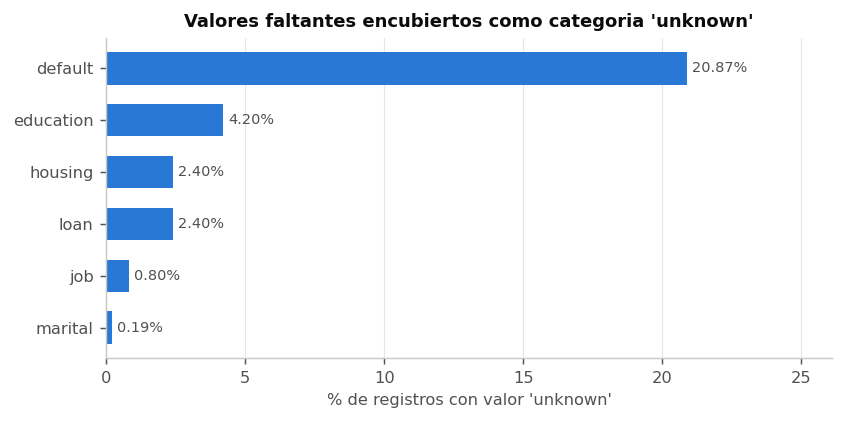
```

```{r}
#| label: tbl-unknown
#| tbl-cap: "Recuento y proporción de valores `unknown` por variable."
leer_tabla("tbl_unknown.csv") |>
  rename(Variable = 1, `N.º unknown` = 2, `% del total` = 3) |>
  tabla_bonita("Valores faltantes encubiertos.")
```

Seis variables están afectadas. El caso crítico es `default`, con
**`r v("pct_unknown_default")`%** de los registros sin información: uno de cada
cinco clientes. Le siguen `education` (4.20%), `housing` y `loan` (2.40% cada
una), `job` (0.80%) y `marital` (0.19%).

La lección metodológica es general y conviene enunciarla: **un dato faltante que
no se declara como tal es más peligroso que uno que sí lo hace**, porque
atraviesa silenciosamente todas las etapas posteriores. Si no se hubiese
inspeccionado el contenido de cada columna categórica, el modelo de la Entrega 2
habría tratado "no sabemos si tiene deudas" como si fuera una característica del
cliente equiparable a "es técnico" o "está casado".

## Duplicados y balance de la variable objetivo

Se detectan **`r v("duplicados", 0)` filas exactamente idénticas** en las 21
columnas. Dado que cada registro documenta una llamada individual —con su
duración en segundos, su día y su contexto macroeconómico—, la coincidencia
simultánea en las 21 variables no es plausible como fenómeno real: son errores
de carga.

```{r}
#| label: fig-target
#| fig-cap: "Distribución de la variable objetivo. El desbalance condiciona toda la evaluación posterior."
#| out-width: "62%"
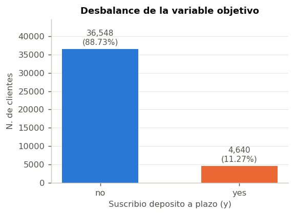
```

La @fig-target muestra el hallazgo que más condiciona el resto del proyecto:
solo el **`r v("tasa_global_pct")`%** de los contactos termina en suscripción.

Esto tiene una consecuencia inmediata para la Entrega 2, que conviene dejar
anotada desde ahora: **la exactitud (*accuracy*) será una métrica engañosa**. Un
clasificador que prediga "no" para absolutamente todos los clientes acertaría el
88.73% de las veces sin haber aprendido nada. La evaluación deberá apoyarse en
precisión, exhaustividad, F1 y AUC sobre la clase minoritaria.

\newpage

# PREPROCESAMIENTO DE LOS DATOS

Cada decisión de esta sección se registró en una bitácora durante la ejecución
del pipeline. La @tbl-bitacora la reproduce íntegra.

```{r}
#| label: tbl-bitacora
#| tbl-cap: "Bitácora de preprocesamiento: qué se hizo y por qué."
leer_tabla("tbl_bitacora.csv") |>
  rename(Paso = 1, `Decisión y justificación` = 2) |>
  kable(booktabs = TRUE, linesep = "",
        caption = "Bitácora de preprocesamiento.") |>
  kable_styling(latex_options = c("HOLD_position", "striped"), font_size = 8) |>
  column_spec(1, width = "3.2cm", bold = TRUE) |>
  column_spec(2, width = "11cm") |>
  row_spec(0, bold = TRUE, align = "c")
```

## Renombrado de columnas

Se normalizaron las 21 columnas a `snake_case` con nombres autoexplicativos en
español. La motivación no es estética: nombres como `emp.var.rate` o
`cons.price.idx` contienen puntos, que en R son el operador de acceso a
componentes y rompen la sintaxis de fórmulas (`y ~ emp.var.rate` se interpreta
mal). Corregirlo ahora evita errores silenciosos en el modelado.

## Eliminación de duplicados

Se eliminaron las 12 filas duplicadas (0.029% del total). El criterio es el
enunciado antes: dos llamadas reales no coinciden en las 21 variables
simultáneamente. El volumen es despreciable y no altera ninguna distribución.

## Tratamiento de valores faltantes

El tratamiento se decidió **columna por columna**, no con una regla única. El
motivo es que en este dataset el faltante no es ruido aleatorio: *es
informativo*.

La evidencia es directa. Quienes no declaran su nivel educativo suscriben al
**14.50%**, por encima del 11.27% global. Quienes no declaran su situación de
impago suscriben al **5.15%**, muy por debajo del 12.88% de quienes declaran no
tener deudas impagas. El hecho de no responder correlaciona con el
comportamiento de compra.

Esto descarta la imputación por moda. Reemplazar `unknown` por la categoría más
frecuente destruiría esa señal y, peor aún, **fabricaría una certeza que el dato
no tiene**: afirmaría que 8,597 clientes no tienen deudas impagas cuando lo
único que se sabe es que no se les preguntó o no contestaron.

La decisión adoptada fue **conservar el faltante como categoría explícita**
(`desconocido`) en `ocupacion`, `estado_civil`, `educacion`,
`prestamo_vivienda` y `prestamo_personal`.

## Recodificación del centinela 999 en `pdays`

La variable `pdays` registra los días transcurridos desde el último contacto de
una campaña anterior. El valor **999 no significa "hace 999 días"**: es un código
centinela que indica *"nunca fue contactado antes"*, y afecta al
**`r v("pct_pdays_999")`%** de los registros.

Tratarlo como un número tiene consecuencias graves y verificables:

- La media de `pdays` en el archivo crudo es **962.5 días**, un valor que no
  describe a ningún cliente real.
- Genera una correlación espuria de **r = -0.588** con `previous`. Esa relación
  es un artefacto del código centinela, no un fenómeno: desaparece al
  recodificar (baja a -0.04), como se verifica en la @fig-corr-pearson.

La solución aplicada descompone la variable en dos, que es lo que en realidad
estaba mezclado:

- `contactado_antes`: indicador binario (0/1).
- `dias_ultimo_contacto`: el valor real, `NA` cuando no aplica.

## Variable degenerada: `default`

La distribución de `default` es **`no`: 32,588 · `unknown`: 8,597 · `yes`: 3**.

Tres casos positivos entre 41,188 registros (0.007%) no permiten estimar nada:
cualquier partición de entrenamiento y prueba dejaría la categoría con cero o un
caso. La variable se sustituyó por el indicador `impago_desconocido`, que sí
discrimina (5.15% frente a 12.88% de conversión) y captura lo único que la
columna informa de manera fiable.

## Conversión de tipos

Se asignó el tipo correcto a cada variable, distinguiendo lo nominal de lo
ordinal. `educacion` (de `illiterate` a `university.degree`), `mes` y
`dia_semana` son factores **ordenados**: su orden es intrínseco y perderlo
impediría detectar tendencias monótonas. El resto de cualitativas son factores
nominales.

## Enriquecimiento: creación de nuevas variables

Se derivaron cinco variables, recogidas en la @tbl-enriquecimiento, cada una con
una justificación concreta:

| Variable | Construcción | Por qué |
|:---|:---|:---|
| `grupo_etario` | Corte de `edad` en 5 tramos | Los extremos etarios se comportan de forma opuesta al centro; el efecto es no lineal y la edad continua lo diluye |
| `contacto_intensivo` | `n_contactos_campana > 3` | Marca al cliente saturado por insistencia |
| `duracion_min` | `duracion / 60` | Unidad interpretable por el área comercial |
| `exito_previo` | `resultado_campana_previa == "success"` | Aísla la señal más fuerte del conjunto |
| `trimestre` | Agrupación de `mes` | Sintetiza la estacionalidad detectada |

: Variables derivadas en la etapa de enriquecimiento. {#tbl-enriquecimiento}

El dataset resultante tiene **`r v("filas_final", 0)` filas** y
**`r v("columnas_final", 0)` columnas**.

\newpage

# ANÁLISIS EXPLORATORIO DE DATOS (EDA)

## Análisis univariado

### Medidas de tendencia central y de dispersión

```{r}
#| include: false
# Las 13 columnas de descriptivos no caben en el ancho de una A4 vertical: la
# columna de curtosis se salia del margen. Se reparten en tres tablas, que
# ademas siguen la division que pide el enunciado (tendencia central por un
# lado, dispersion por otro) en vez de amontonarlo todo.
desc <- leer_tabla("tbl_descriptivos.csv") |>
  mutate(across(where(is.numeric), ~ round(.x, 2)))
```

```{r}
#| label: tbl-centrales
#| tbl-cap: "Medidas de tendencia central de las variables numéricas."
desc |>
  select(Variable, Media, Mediana, Moda) |>
  tabla_bonita("Medidas de tendencia central.", fs = 8)
```

```{r}
#| label: tbl-dispersion
#| tbl-cap: "Medidas de dispersión de las variables numéricas."
desc |>
  select(Variable, `Desv. Est.` = Desv_Est, Varianza, Rango, RIC,
         `CV %` = CV_pct) |>
  tabla_bonita("Medidas de dispersión.", fs = 8)
```

```{r}
#| label: tbl-cuartiles
#| tbl-cap: "Cuartiles y medidas de forma de las variables numéricas."
desc |>
  select(Variable, Mín = Min, Q1, Q3, Máx = Max,
         Asimetría = Asimetria, Curtosis) |>
  tabla_bonita("Cuartiles y medidas de forma.", fs = 8)
```

Las medidas solo tienen lectura conjunta: una media sin su dispersión no informa
sobre su propia representatividad. Los casos que merecen comentario:

**`edad`** — Media 40.0 y mediana 38.0 años, muy próximas, con asimetría leve
(+0.78). La distribución es razonablemente simétrica y la media es un buen
resumen. El coeficiente de variación del 26% indica una población homogénea en
edad.

**`duracion`** — Media 258 segundos frente a mediana 180. La media supera a la
mediana en un 43%, señal de asimetría positiva marcada (+3.26) arrastrada por
llamadas muy largas: el máximo es de 4,918 segundos (82 minutos). Aquí **la
media no es representativa** y debe usarse la mediana.

**`n_contactos_campana`** — Mediana de 2 contactos, pero máximo de **56**.
Asimetría extrema (+4.76) y curtosis muy elevada. La cola derecha describe un
comportamiento operativo concreto: un pequeño grupo de clientes fue llamado de
forma insistente.

**`idx_confianza` y `var_empleo`** — Presentan coeficientes de variación
distorsionados por tomar valores negativos, y sus distribuciones son
multimodales. Esto no es un defecto del dato sino su naturaleza: son
indicadores **mensuales** repetidos en todas las llamadas del mismo mes, por lo
que toman pocos valores distintos.

### Histogramas

```{r}
#| label: fig-histogramas
#| fig-cap: "Distribución de frecuencias de las diez variables numéricas. La línea naranja marca la media; la discontinua, la mediana."
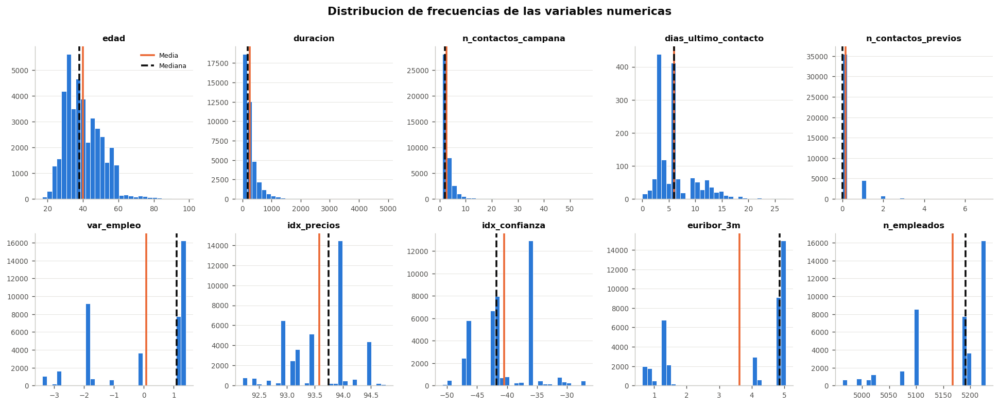
```

La @fig-histogramas confirma tres patrones distintos:

1. **Asimetría positiva fuerte** en `duracion`, `n_contactos_campana` y
   `n_contactos_previos`: muchos valores bajos y una cola derecha larga. Son
   candidatas naturales a transformación logarítmica si el modelo posterior lo
   requiere.
2. **Cuasi-simetría** en `edad`, la única variable con forma aproximadamente
   normal.
3. **Multimodalidad** en las cinco macroeconómicas. La separación en bloques
   discretos refleja los regímenes de tasa que atravesó el período 2008–2010, y
   permite anticipar que actuarán como un *proxy* del momento temporal.

La distancia visible entre media y mediana en `duracion` y
`n_contactos_campana` es la traducción gráfica de la asimetría ya comentada.

### Diagramas de caja

```{r}
#| label: fig-boxplots
#| fig-cap: "Dispersión y valores atípicos de las variables numéricas según el criterio de Tukey."
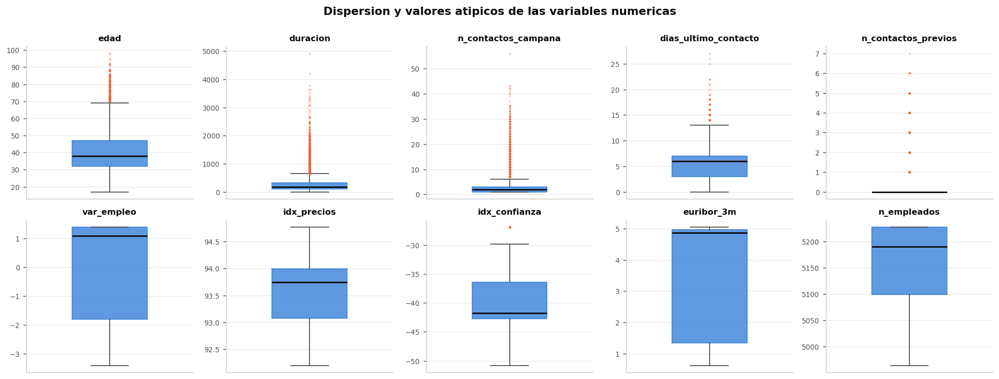
```

```{r}
#| label: tbl-outliers
#| tbl-cap: "Valores atípicos detectados por el criterio de Tukey (1.5 × RIC)."
leer_tabla("tbl_outliers.csv") |>
  rename(Variable = 1, `Límite inf.` = 2, `Límite sup.` = 3,
         `N.º atípicos` = 4, `% atípicos` = 5) |>
  tabla_bonita("Detección de valores atípicos.")
```

El punto crítico de esta sección es **cómo interpretar los atípicos**. El
criterio de Tukey [@tukey1977] los marca como extremos respecto de la
distribución, pero eso no los convierte en errores.

En `duracion` y `n_contactos_campana` los valores extremos son **genuinos y
además informativos**: una llamada de 82 minutos es exactamente el tipo de
conversación que termina en contratación. Eliminarlos destruiría la señal más
fuerte del conjunto. En `edad`, los clientes por encima de 70 años tampoco son
errores: la @fig-conversion-cat mostrará que el segmento de 60+ años convierte
al 45.5%, cuatro veces la media.

La decisión adoptada es **conservar todos los valores atípicos**. Son
observaciones válidas de un fenómeno con cola larga, no ruido de medición.

### Variables cualitativas

```{r}
#| label: fig-barras-cat
#| fig-cap: "Frecuencia de las categorías en las variables cualitativas."
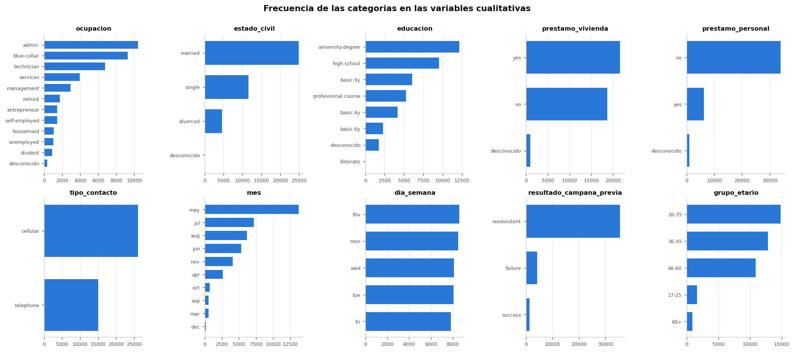
```

Los desequilibrios relevantes que muestra la @fig-barras-cat:

- **`ocupacion`** está dominada por `admin.` (10,422) y `blue-collar` (9,254),
  mientras `student` apenas reúne 875 casos. Las tasas de conversión de los
  grupos pequeños deberán leerse con cautela por su menor precisión.
- **`mes`** presenta una concentración extrema: mayo acumula
  **`r v("n_may", 0)` llamadas**, un tercio del total, mientras diciembre reúne
  182. Además faltan enero y febrero por completo.
- **`resultado_campana_previa`** es `nonexistent` en el 86% de los casos,
  coherente con el 96.32% de `pdays = 999`.

### Tabla de frecuencias agrupadas

```{r}
#| label: tbl-frecuencias
#| tbl-cap: "Distribución de frecuencias de la edad agrupada en intervalos de 10 años."
leer_tabla("tbl_frecuencias_edad.csv") |>
  rename(Intervalo = 1, `Frec. absoluta` = 2, `Marca de clase` = 3,
         `Frec. acumulada` = 4, `Frec. relativa %` = 5,
         `Frec. rel. acum. %` = 6) |>
  tabla_bonita("Frecuencias agrupadas de la edad.")
```

La concentración se sitúa en los intervalos de 25 a 45 años, que reúnen cerca
del 66% de los contactados: la base de clientes de la campaña es
predominantemente adulta-joven en edad laboral activa.

\newpage

## Análisis multivariado

### Mapa de calor de correlaciones

```{r}
#| label: fig-corr-pearson
#| fig-cap: "Correlación de Pearson entre variables numéricas (datos ya preprocesados)."
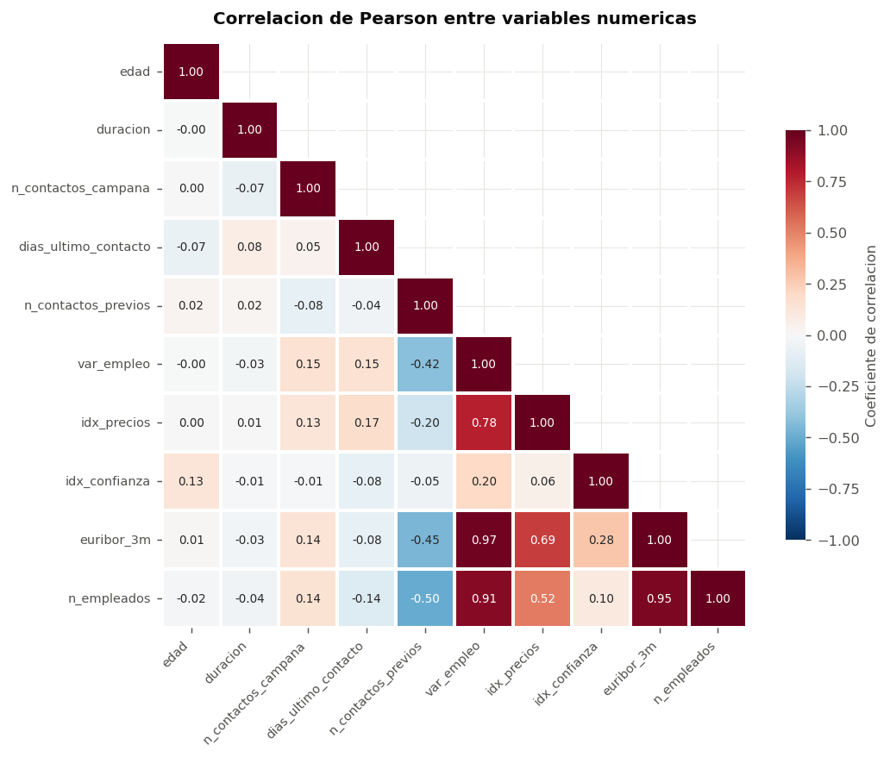
```

```{r}
#| label: fig-corr-spearman
#| fig-cap: "Correlación de Spearman. Al basarse en rangos, es robusta frente a los valores atípicos detectados."
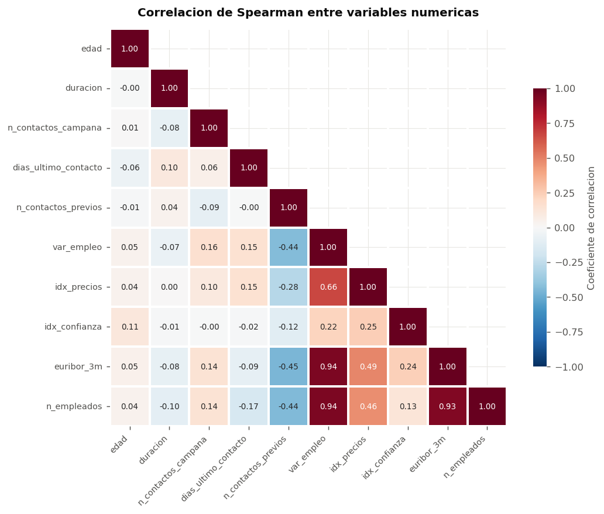
```

Se calcularon **ambos coeficientes de forma deliberada**. Pearson mide relación
lineal y es sensible a los valores extremos que el análisis univariado dejó en
evidencia; Spearman opera sobre rangos, detecta cualquier relación monótona y
resiste esos extremos. La coincidencia entre ambos refuerza las conclusiones; la
discrepancia señalaría no linealidad.

```{r}
#| label: tbl-colinealidad
#| tbl-cap: "Pares de variables con correlación superior a 0.5 en valor absoluto."
leer_tabla("tbl_colinealidad.csv") |>
  rename(`Variable A` = 1, `Variable B` = 2) |>
  tabla_bonita("Pares con riesgo de colinealidad.")
```

El hallazgo dominante es un **bloque de colinealidad severa** entre las
variables macroeconómicas:

- `euribor_3m` ~ `var_empleo`: **r = `r v("r_euribor_varempleo", 3)`**
- `euribor_3m` ~ `n_empleados`: **r = `r v("r_euribor_nempleados", 3)`**
- `var_empleo` ~ `n_empleados`: r = +0.907
- `var_empleo` ~ `idx_precios`: r = +0.775

Con r = 0.972, `euribor_3m` y `var_empleo` son **estadísticamente la misma
variable**: una explica el 94.5% de la varianza de la otra. No es casualidad
económica sino estructural, ya que las cuatro son manifestaciones del mismo
ciclo macroeconómico medidas mensualmente.

La implicancia para la Entrega 2 es concreta: incluir las cinco en un modelo
lineal o en una regresión logística produce **inflación de la varianza de los
coeficientes**, signos erráticos e interpretaciones sin sentido. La
recomendación es **conservar una sola como representante del bloque**
—`euribor_3m`, por ser la de lectura económica más directa— o aplicar reducción
de dimensionalidad.

Conviene además registrar un resultado del preprocesamiento: la correlación
`pdays` ~ `previous` de **-0.588** presente en los datos crudos **desaparece
(-0.04)** una vez recodificado el centinela 999. Era un artefacto del código, no
una relación. Es la demostración más limpia de por qué el orden importa: un
análisis de correlaciones ejecutado antes de limpiar habría reportado una
relación inexistente.

### Covarianza

```{r}
#| label: tbl-covarianza
#| tbl-cap: "Matriz de covarianzas de las variables numéricas."
# Lo que fuerza el ancho de esta tabla son los encabezados, no las cifras:
# 10 nombres como 'n_contactos_campana' no caben en el ancho de texto.
# abbreviate() de R base los acorta GARANTIZANDO unicidad, que es justo lo que
# fallaba al truncar a mano (n_contactos_campana y n_contactos_previos
# colapsaban en la misma cadena y rename_with() abortaba).
cov_df <- leer_tabla("tbl_covarianza.csv") |>
  rename(Variable = 1) |>
  mutate(across(where(is.numeric), ~ round(.x, 1)))

# La matriz es cuadrada: filas y columnas llevan las variables en el mismo
# orden, asi que una unica tabla de abreviaturas sirve para ambas.
abrev <- unname(abbreviate(cov_df$Variable, minlength = 9))
cov_df$Variable <- abrev
names(cov_df)[-1] <- abrev

cov_df |> tabla_bonita("Matriz de covarianzas.", fs = 6, ajustar = TRUE)
```

La covarianza comparte el signo con la correlación pero **no es comparable entre
pares**, porque conserva las unidades de las variables implicadas. La matriz lo
ilustra con claridad: la covarianza entre `duracion` y `n_empleados` alcanza
magnitudes de millares simplemente porque `n_empleados` se mide en miles de
personas y `duracion` en segundos, no porque la relación sea intensa —su
correlación es apenas -0.04.

Por eso el análisis de intensidad se apoya en la correlación, que es
adimensional y acotada en $[-1, 1]$. La covarianza se reporta porque es el
insumo del cual se deriva:

$$
\corr{x}{y} \;=\; \frac{\Cov(x, y)}{s_x \, s_y}
$$ {#eq-corr}

### Relación de cada variable numérica con el objetivo

```{r}
#| label: fig-corr-target
#| fig-cap: "Correlación de cada variable numérica con la suscripción codificada como 0/1."
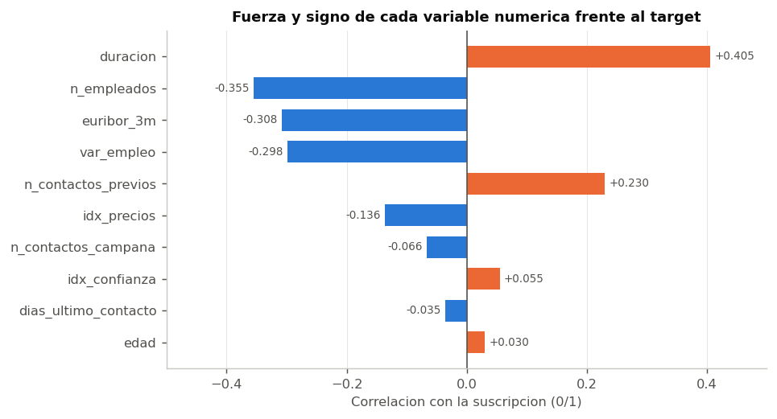
```

```{r}
#| label: fig-box-comp
#| fig-cap: "Boxplots comparativos: distribución de cada variable numérica según el resultado de la llamada."
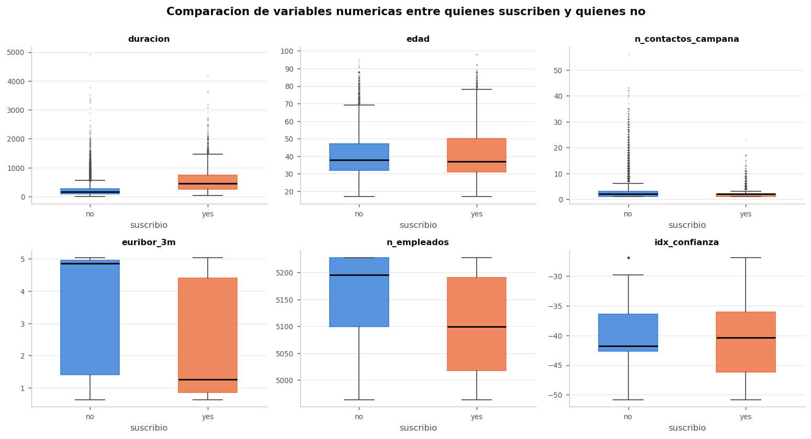
```

La @fig-corr-target ordena las variables por su asociación con el objetivo, y la
@fig-box-comp muestra la misma información como distribuciones comparadas.

**`duracion` encabeza la lista con r = `r v("r_duracion_target", 3)`**, y la
@fig-box-comp lo confirma visualmente: la caja de quienes suscriben está
completamente desplazada hacia arriba respecto de quienes no. La sección
siguiente explica por qué este resultado, lejos de ser una buena noticia, es el
problema metodológico central del dataset.

El segundo bloque lo forman las macroeconómicas, todas con signo negativo
(`n_empleados` -0.355, `euribor_3m` -0.308, `var_empleo` -0.298): **la
suscripción aumenta cuando la economía se deteriora**. La lectura económica es
coherente. En un entorno de tasas altas y empleo en expansión, el cliente
encuentra alternativas más rentables que un depósito a plazo; cuando las tasas
caen y el empleo se contrae, el depósito gana atractivo relativo como refugio.

`edad` tiene una correlación lineal prácticamente nula (r = +0.030), pero esto
**no significa que sea irrelevante**: su efecto es no lineal, como se verá en la
@fig-conversion-cat. Es un buen ejemplo de por qué la correlación de Pearson no
debe usarse como único criterio de selección de variables.

### `duracion`: fuga de información

```{r}
#| label: fig-duracion
#| fig-cap: "Distribución de la duración de la llamada según el resultado, y tasa de suscripción por tramo de duración."
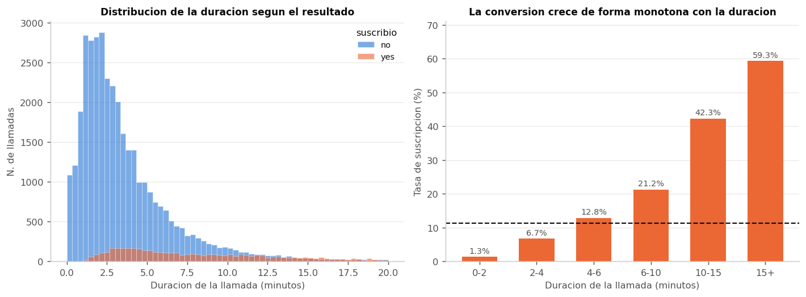
```

La @fig-duracion documenta la relación más fuerte del conjunto. La tasa de
suscripción crece de forma monótona con la duración: **1.3%** en llamadas de
menos de 2 minutos, **12.8%** entre 4 y 6 minutos, **42.3%** entre 10 y 15, y
**59.3%** por encima de 15 minutos. La mediana de duración es de 2.7 minutos
entre quienes rechazan y 7.5 minutos entre quienes aceptan.

**Esta variable no puede usarse para predecir.** El razonamiento es de
causalidad y de disponibilidad temporal:

1. La duración de una llamada **solo se conoce cuando la llamada ha terminado**.
   En el momento en que el modelo debe decidir a quién llamar, el dato no
   existe.
2. La relación es inversa a la que aparenta. No es que hablar mucho convenza al
   cliente; es que el cliente interesado prolonga la conversación. La duración
   es **consecuencia** del interés, no su causa.
3. Una llamada de duración 0 segundos implica necesariamente `y = "no"`. La
   variable contiene el resultado.

Este fenómeno se conoce como **fuga de información** (*data leakage*) y está
documentado de forma sistemática por @kaufman2012. Los propios autores del
dataset lo advierten explícitamente [@moro2014]. Un modelo
que incluyera `duracion` alcanzaría métricas excelentes en validación y sería
**completamente inútil en producción**.

Se conserva en el análisis exploratorio, porque describe correctamente la
dinámica de la campaña, y se **excluirá del conjunto de predictores en la
Entrega 2**.

### Comparación entre grupos: variables cualitativas

```{r}
#| label: fig-conversion-cat
#| fig-cap: "Tasa de suscripción por categoría. La línea discontinua marca la media global de 11.27%."
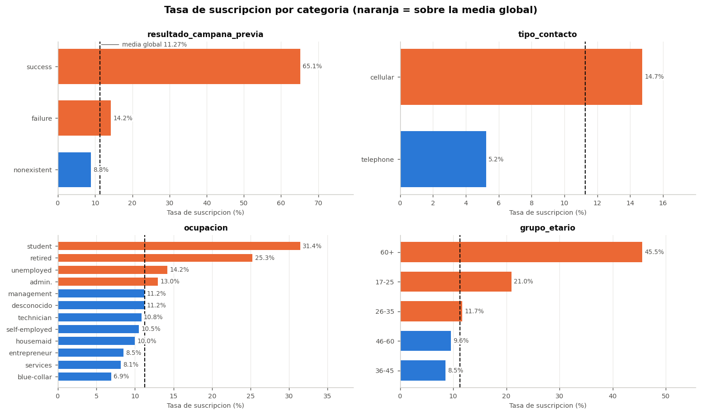
```

La @fig-conversion-cat concentra los hallazgos de mayor valor comercial:

**`resultado_campana_previa` es el predictor más potente disponible.** Los
clientes que aceptaron una oferta anterior suscriben al
**`r v("conv_poutcome_success")`%**, casi seis veces la media global. Es una
señal accionable de inmediato: existe un segmento de clientes receptivos, ya
identificado, de apenas 1,373 personas.

**El canal importa, y mucho.** El teléfono móvil convierte al
**`r v("conv_cellular")`%** frente al **`r v("conv_telephone")`%** de la línea
fija: casi el triple. Parte del efecto es probablemente indirecto —quien tiene
móvil registrado en 2008–2010 pertenece a un perfil demográfico distinto—, pero
la magnitud justifica priorizar el canal móvil.

**La edad tiene efecto en forma de U.** Los extremos convierten muy por encima
de la media: **45.5%** en mayores de 60 años y **21.0%** entre 17 y 25, frente a
solo **8.5%** en el tramo de 36 a 45. El patrón es interpretable: jubilados y
estudiantes disponen de horizontes de ahorro y perfiles de riesgo compatibles
con un depósito a plazo, mientras que la franja de mediana edad soporta
hipotecas y gastos familiares. Esta forma de U es exactamente lo que la
correlación lineal de +0.030 no podía capturar.

Coherentemente, en `ocupacion` destacan `student` (31.4%) y `retired` (25.3%),
mientras `blue-collar` (6.9%) y `services` (8.1%) quedan muy por debajo.

### Estacionalidad: esfuerzo frente a efectividad

```{r}
#| label: fig-estacionalidad
#| fig-cap: "Volumen de llamadas y tasa de suscripción por mes. Los dos paneles comparten el eje horizontal."
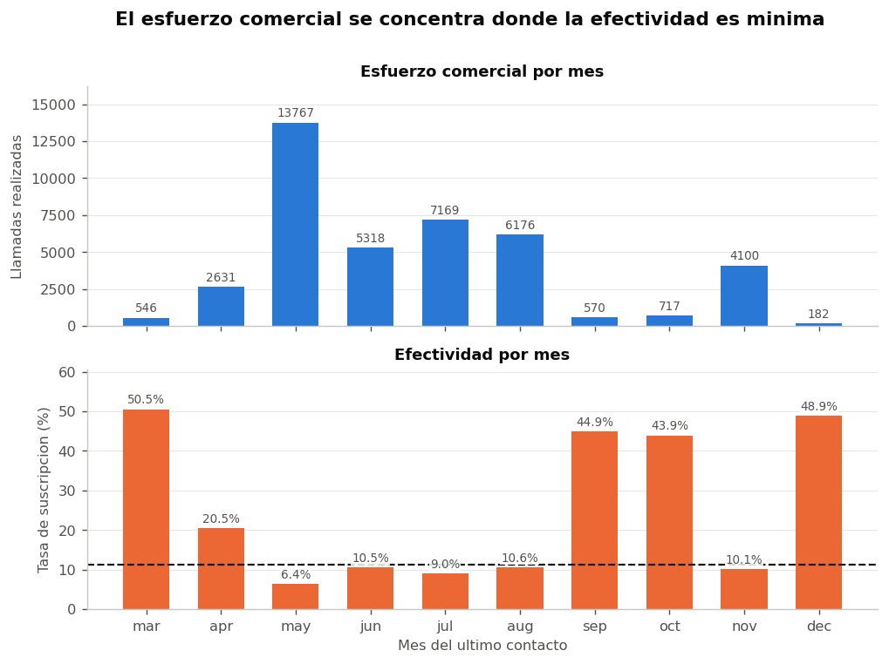
```

```{r}
#| label: tbl-estacionalidad
#| tbl-cap: "Volumen de contactos y tasa de suscripción por mes."
leer_tabla("tbl_estacionalidad.csv") |>
  rename(Mes = 1, `N.º llamadas` = 2, `Tasa suscripción %` = 3) |>
  tabla_bonita("Estacionalidad de la campaña.")
```

La @fig-estacionalidad presenta el hallazgo de mayor impacto operativo del
análisis. Se emplean **dos paneles apilados y no un gráfico de doble eje**: las
unidades (número de llamadas y porcentaje) no son comparables, y superponerlas
en una sola escala induciría a leer una relación entre curvas que el gráfico no
puede sustentar.

El contraste es claro. **Mayo concentra `r v("n_may", 0)` llamadas —un tercio de
toda la campaña— y convierte apenas al `r v("conv_may")`%**, la peor tasa del
año. En el extremo opuesto, **marzo convierte al `r v("conv_mar")`%** con solo
546 llamadas; diciembre, septiembre y octubre se sitúan entre el 43% y el 49%
con volúmenes igualmente reducidos.

Existe una **relación inversa entre el esfuerzo comercial desplegado y su
efectividad**. Los meses de mayor inversión son los de peor rendimiento.

Este resultado admite dos lecturas que conviene distinguir con honestidad:

- **Lectura operativa:** la asignación de recursos está mal calibrada y
  redistribuir volumen hacia los meses de alta conversión elevaría el
  rendimiento agregado.
- **Lectura cautelosa:** los meses de alta conversión tienen volúmenes muy
  pequeños, y es posible que se contactara en ellos a segmentos previamente
  seleccionados. Además, `mes` está fuertemente confundido con las variables
  macroeconómicas, que también varían mensualmente.

Los datos disponibles no permiten separar ambos efectos. Lo que sí queda
establecido es que **el mes de contacto es una variable con alto poder
explicativo** que debe incorporarse al modelo.

### Diagramas de dispersión

```{r}
#| label: fig-scatter
#| fig-cap: "Seis combinaciones de pares de variables numéricas sobre una muestra aleatoria de 4,000 registros."
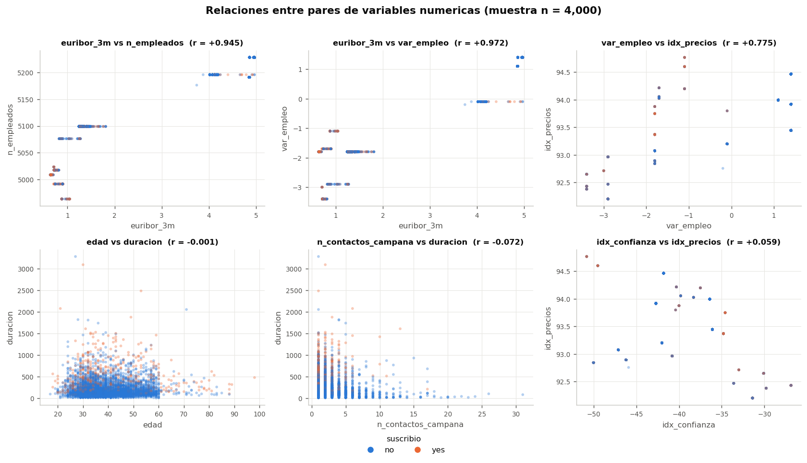
```

Se trabajó sobre una **muestra aleatoria de 4,000 registros** y con opacidad
reducida: con 41,176 puntos el solapamiento oculta por completo la densidad. El
orden de dibujo se aleatorizó para que ninguna de las dos clases tape
sistemáticamente a la otra, lo que induciría a percibir una prevalencia falsa.

Interpretación de cada panel:

1. **`euribor_3m` vs `n_empleados` (r = +0.945)** — Los puntos no forman una
   nube sino **bloques discretos**. Cada bloque corresponde a un mes del
   período: ambos indicadores son mensuales y se repiten idénticos en todas las
   llamadas de ese mes. La alineación casi perfecta confirma la colinealidad.

2. **`euribor_3m` vs `var_empleo` (r = +0.972)** — El caso extremo. La relación
   es prácticamente funcional; conocer una determina la otra.

3. **`var_empleo` vs `idx_precios` (r = +0.775)** — Relación positiva clara pero
   con más dispersión, lo que sugiere que el índice de precios aporta algo de
   información propia frente al bloque.

4. **`edad` vs `duracion` (r = -0.001)** — Ausencia total de relación lineal: una
   nube sin estructura. Es un resultado útil, porque descarta que la duración de
   la llamada dependa de la edad del cliente. Se aprecia la mayor densidad de
   puntos naranjas en la zona superior, reflejo de la asociación entre duración
   y suscripción.

5. **`n_contactos_campana` vs `duracion` (r = -0.072)** — Se observa un patrón en
   forma de L: las llamadas largas se concentran en los primeros contactos, y a
   partir del quinto contacto la duración cae drásticamente. La interpretación
   es directa: **la insistencia agota la paciencia del cliente**. Es la
   justificación empírica de la variable `contacto_intensivo`.

6. **`idx_confianza` vs `idx_precios` (r = +0.059)** — Correlación casi nula
   entre dos indicadores macro, lo que muestra que el bloque no es
   completamente redundante: la confianza del consumidor aporta una dimensión
   independiente.

\newpage

## Conclusiones generales del EDA

### Sobre la calidad de los datos

El dataset **no estaba limpio pese a declararse como tal**. Las funciones
estándar de detección de nulos reportaban cero faltantes, cuando en realidad
existían valores ausentes en seis variables, un código centinela que
distorsionaba la media de `pdays` en tres órdenes de magnitud y una variable con
tres observaciones en una de sus categorías.

La verificación manual del contenido de cada columna fue lo que permitió
detectarlo. Es la conclusión metodológica principal de esta entrega.

### Sobre la colinealidad

Existe un **bloque macroeconómico fuertemente colineal** (`euribor_3m`,
`var_empleo`, `n_empleados`, `idx_precios`) con correlaciones de hasta
**`r v("r_euribor_varempleo", 3)`**. Las cuatro miden el mismo ciclo. Deberá
seleccionarse una representante o aplicarse reducción de dimensionalidad antes
de ajustar cualquier modelo lineal.

Fuera de ese bloque, el resto de variables presenta correlaciones bajas entre
sí, lo que es favorable: aportan información complementaria y no redundante.

### Variables clave identificadas

Ordenadas por valor esperado para el modelado:

1. **`resultado_campana_previa` / `exito_previo`** — La señal más fuerte
   legítimamente utilizable (65.1% de conversión).
2. **`mes` y `trimestre`** — Rango de variación del 6.4% al 50.6%.
3. **Bloque macroeconómico (una representante)** — Correlaciones de -0.30 a
   -0.36 con el objetivo.
4. **`tipo_contacto`** — 14.7% frente a 5.2%.
5. **`grupo_etario`** — Efecto en U que la edad continua no captura.
6. **`ocupacion`** — Rango del 6.9% al 31.4%.

### Variables a excluir o tratar con cuidado

- **`duracion`** — Excluir del conjunto de predictores por fuga de información,
  pese a ser la variable con mayor correlación con el objetivo.
- **`default` original** — Excluida ya en el preprocesamiento por degenerada.
- **`prestamo_vivienda` y `prestamo_personal`** — Sus tasas de conversión
  (11.6% y 10.9%) son indistinguibles de la media global: no discriminan.
- **Cuatro de las cinco macroeconómicas** — Por colinealidad.

### Implicancias para la Entrega 2

1. El desbalance del **`r v("tasa_global_pct")`%** obliga a evaluar con
   precisión, exhaustividad, F1 y AUC, nunca con exactitud.
2. Deberán considerarse técnicas de remuestreo o ponderación de clases.
3. La partición entrenamiento/prueba debe ser **estratificada** por la variable
   objetivo.
4. El efecto no lineal de la edad favorece a los modelos basados en árboles
   frente a la regresión logística, o exige incorporar `grupo_etario` como
   factor.

\newpage

# ANEXO: CÓDIGO DEL PIPELINE

El análisis completo es reproducible mediante el script
`src/eda_bank.py`, que genera las 13 figuras y las 14 tablas empleadas en este
informe. El script `src/eda_bank.R` implementa el mismo pipeline en R con
`tidyverse` y `ggplot2`.

```{r}
#| echo: true
#| eval: false
# Ejecución del pipeline completo (desde la raíz del proyecto):
#
#   python src/eda_bank.py     # genera figs/ y tablas/
#   Rscript src/eda_bank.R     # versión equivalente en R
#
# El informe lee los resultados desde tablas/ y figs/, de modo que las cifras
# citadas en el texto no pueden desincronizarse del análisis.
```

A modo de verificación, se reproduce la carga y el diagnóstico inicial en R
sobre los datos ya preprocesados:

```{r}
#| echo: true
#| label: tbl-verificacion
#| tbl-cap: "Verificación en R sobre el dataset preprocesado."
limpio <- readr::read_csv("datos/bank_limpio.csv", show_col_types = FALSE)

tibble(
  Métrica = c("Filas", "Columnas", "Suscripciones", "Tasa de suscripción (%)"),
  Valor = c(
    format(nrow(limpio), big.mark = ","),
    as.character(ncol(limpio)),
    format(sum(limpio$suscribio_bin), big.mark = ","),
    sprintf("%.2f", mean(limpio$suscribio_bin) * 100)
  )
) |>
  tabla_bonita("Verificación del dataset preprocesado.")
```

\newpage
